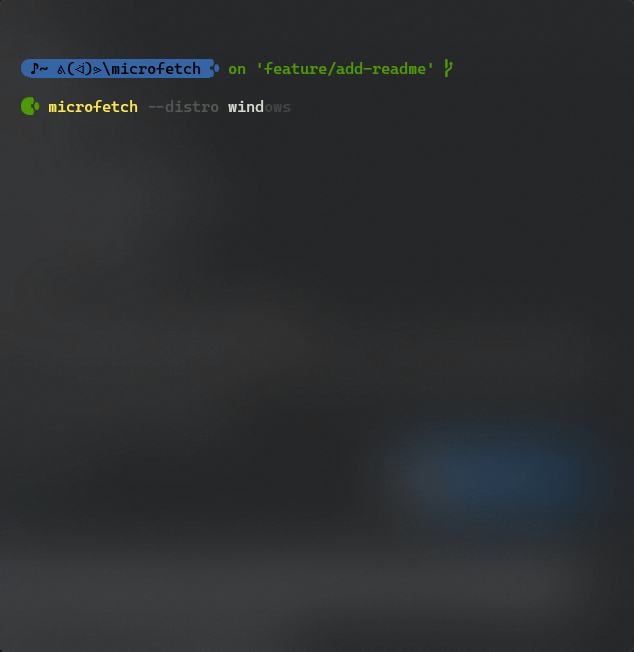

[![build badge]][build link] [![GitHub last commit]][commit history]
[![GitHub commit activity]][commit frequency]

## Summary

Microfetch is an improved version of neofetch written with [micronaut] and built with [graalvm].




### Install

#### Windows


<ol>
    <li>Download latest windows <a href="https://github.com/Jonathan-Zollinger/Microfetch/releases/latest">binary</a></li>
    <li>Move executable to dedicated directory, ie <code>C:\Program Files\threshr\</code></li>
    <li>Add directory to your PATH <details><summary>(I like to add this snippet to my ps profile)</summary>

```PowerShell
"C:\Program Files\threshr\" |
if (!($env:Path -like "*$_*"))
{
    $env:Path = "$( $env:Path );$_"
}
```

</details></li></ol>

#### Linux
<ol>
        <li>Download latest linux <a href="https://github.com/Jonathan-Zollinger/Microfetch/releases/latest">binary</a></li>
        <li>Add to <code>$HOME\bin\</code> directory</li>
</ol>

___

### Want to get involved?

See our [contributing] doc before taking a whack at any [open issues]. We'd love for you to work with us!


[build badge]:https://img.shields.io/github/actions/workflow/status/Jonathan-Zollinger/Microfetch/gradle.yml?style=plastic&logo=github&label=Gradle%20Build&link=https%3A%2F%2Fgithub.com%2FJonathan-Zollinger%2FMicrofetch%2Factions%20build-status%20

[build link]:https://github.com/Jonathan-Zollinger/Microfetch/actions/workflows/maven.yml

[open issues]:https://github.com/Jonathan-Zollinger/Microfetch/issues"open-issues"

[//]: # ([contributing]:Contributing.md)

[GitHub code size in bytes]:https://img.shields.io/github/languages/code-size/Jonathan-Zollinger/Microfetch?style=plastic%20project-size%20

[download link]:https://github.com/Jonathan-Zollinger/Microfetch/archive/refs/heads/main.zip

[license]:https://img.shields.io/github/license/Jonathan-Zollinger/Microfetch?style=plastic"GPL-3-License"

[//]: # ([license file]:LICENSE)

[GitHub last commit]:https://img.shields.io/github/last-commit/Jonathan-Zollinger/Microfetch/main?style=plastic%20most-recent-commit

[commit history]:https://github.com/Jonathan-Zollinger/Microfetch/commits/main

[GitHub commit activity]:https://img.shields.io/github/commit-activity/y/Jonathan-Zollinger/Microfetch?style=plastic"commit-frequency"

[commit frequency]:https://github.com/Jonathan-Zollinger/Microfetch/graphs/code-frequency

[micronaut]:https://micronaut.io/
[graalvm]:https://micronaut.io/2019/04/26/micronaut-and-graalvm-the-ultimate-recipe-for-fast-lightweight-powerful-apps/
