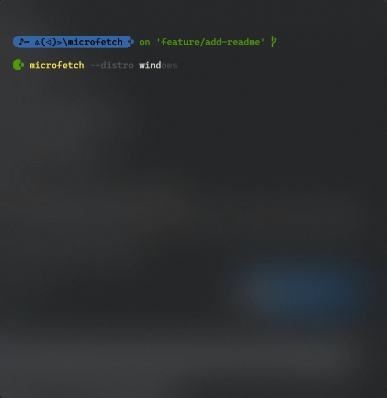

[![build badge]][build link]
[![GitHub commit activity]][commit frequency] [![issues badge]][open issues link] ![open issues for next release badge and link]


## Summary

Microfetch is an improved version of neofetch written with [micronaut] and built with [graalvm].




### Install

#### Windows


<ol>
    <li>Download latest windows <a href="https://github.com/Jonathan-Zollinger/Microfetch/releases/latest">binary</a></li>
    <li>Move executable to dedicated directory, ie <code>C:\Program Files\threshr\</code></li>
    <li>Add directory to your PATH <details><summary>(I like to add this snippet to my ps profile)</summary>

Assuming you've added the microfetch binary to `C:\Program Files\microfetch\`,

```PowerShell
"C:\Program Files\microfetch\" |
if ( ! ($env:Path -like "*$_*" ) ) {
    $env:Path = "$( $env:Path ); $_"
}
```

</details></li></ol>

#### Linux
<ol>
        <li>Download latest linux <a href="https://github.com/Jonathan-Zollinger/Microfetch/releases/latest">binary</a></li>
        <li>Add to <code>$HOME\bin\</code> directory</li>
</ol>

___

### Want to get involved?

Take a whack at any [open issues]!


[build badge]:https://img.shields.io/github/actions/workflow/status/Jonathan-Zollinger/Microfetch/test-changes.yml?style=for-the-badge&logo=github&label=Gradle%20Build&link=https%3A%2F%2Fgithub.com%2FJonathan-Zollinger%2FMicrofetch%2Factions%20build-status%20
[build link]:https://github.com/Jonathan-Zollinger/Microfetch/actions/workflows/test-changes.yml
[issues badge]:https://img.shields.io/github/issues/jonathan-zollinger/microfetch?style=for-the-badge
[open issues link]:https://github.com/Jonathan-Zollinger/Microfetch/issues
[open issues for next release badge and link]:https://img.shields.io/github/milestones/issues-open/jonathan-zollinger/microfetch/1?style=for-the-badge&label=remaining%20issues%20for%20release%20v0.0.1&link=https%3A%2F%2Fgithub.com%2FJonathan-Zollinger%2Fmicrofetch%2Fmilestones
[download link]:https://github.com/Jonathan-Zollinger/Microfetch/archive/refs/heads/main.zip
[license]:https://img.shields.io/github/license/Jonathan-Zollinger/Microfetch?style=for-the-badge"GPL-3-License"
[//]: # ([license file]:LICENSE)
[GitHub commit activity]:https://img.shields.io/github/commit-activity/w/jonathan-zollinger/microfetch?style=for-the-badge
[commit frequency]:https://github.com/Jonathan-Zollinger/Microfetch/graphs/code-frequency
[micronaut]:https://micronaut.io/
[graalvm]:https://micronaut.io/2019/04/26/micronaut-and-graalvm-the-ultimate-recipe-for-fast-lightweight-powerful-apps/
