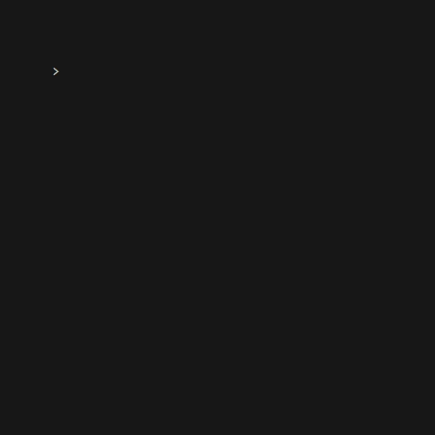

[![build badge]][build link] [![Coverage][sonar-coverage-badge]][sonar-coverage] [![Code Smells][sonar-code-smells-badge]][sonar-code-smells] [![Security Rating][sonar-security-rating-badge]][sonar-security-rating] [![Technical Debt][sonar-technical-debt-badge]][sonar-technical-debt] [![Vulnerabilities][sonar-vulnerabilities-badge]][sonar-vulnerabilities]

[![Quality Gate Status][sonar-quality-gate-badge]][sonar-quality-gate]

## Summary

Microfetch is an improved version of neofetch written with [micronaut] and built with [graalvm].




### Install

#### Windows


<ol>
    <li>Download latest windows <a href="https://github.com/Jonathan-Zollinger/Microfetch/releases/latest">binary</a></li>
    <li>Move executable to dedicated directory, ie <code>C:\Program Files\threshr\</code></li>
    <li>Add directory to your PATH <details><summary>(I like to add this snippet to my ps profile)</summary>

Assuming you've added the microfetch binary to `C:\Program Files\microfetch\`,

```PowerShell
$newPath = "C:\Program Files\microfetch\"
if (-not ($env:Path -like "*$newPath*")) {
    $env:Path += ";$newPath"
}
```

</details></li></ol>

#### Linux
<ol>
        <li>Download latest linux <a href="https://github.com/Jonathan-Zollinger/Microfetch/releases/latest">binary</a></li>
        <li>Add to <code>$HOME\bin\</code> directory</li>
</ol>

___

### Want to get involved?

Take a whack at any [open issues]!


[build badge]:https://img.shields.io/github/actions/workflow/status/Jonathan-Zollinger/Microfetch/test-changes.yml?style=plastic&logo=github&label=Gradle%20Build&link=https%3A%2F%2Fgithub.com%2FJonathan-Zollinger%2FMicrofetch%2Factions%20build-status%20
[build link]:https://github.com/Jonathan-Zollinger/Microfetch/actions/workflows/test-changes.yml
[download link]:https://github.com/Jonathan-Zollinger/Microfetch/archive/refs/heads/main.zip
[license]:https://img.shields.io/github/license/Jonathan-Zollinger/Microfetch?style=plastic"GPL-3-License"
[//]: # ([license file]:LICENSE)
[micronaut]:https://micronaut.io/
[graalvm]:https://micronaut.io/2019/04/26/micronaut-and-graalvm-the-ultimate-recipe-for-fast-lightweight-powerful-apps/
[open issues]:https://github.com/Jonathan-Zollinger/microfetch/issues
[sonar-vulnerabilities-badge]: https://sonarcloud.io/api/project_badges/measure?project=Jonathan-Zollinger_microfetch&metric=vulnerabilities
[sonar-vulnerabilities]: https://sonarcloud.io/summary/new_code?id=Jonathan-Zollinger_microfetch
[sonar-coverage-badge]: https://sonarcloud.io/api/project_badges/measure?project=Jonathan-Zollinger_microfetch&metric=coverage
[sonar-coverage]: https://sonarcloud.io/summary/new_code?id=Jonathan-Zollinger_microfetch
[sonar-code-smells-badge]: https://sonarcloud.io/api/project_badges/measure?project=Jonathan-Zollinger_microfetch&metric=code_smells
[sonar-code-smells]: https://sonarcloud.io/summary/new_code?id=Jonathan-Zollinger_microfetch
[sonar-security-rating-badge]: https://sonarcloud.io/api/project_badges/measure?project=Jonathan-Zollinger_microfetch&metric=security_rating
[sonar-security-rating]: https://sonarcloud.io/summary/new_code?id=Jonathan-Zollinger_microfetch
[sonar-technical-debt-badge]: https://sonarcloud.io/api/project_badges/measure?project=Jonathan-Zollinger_microfetch&metric=sqale_index
[sonar-technical-debt]: https://sonarcloud.io/summary/new_code?id=Jonathan-Zollinger_microfetch
[sonar-quality-gate-badge]: https://sonarcloud.io/api/project_badges/measure?project=Jonathan-Zollinger_microfetch&metric=alert_status
[sonar-quality-gate]: https://sonarcloud.io/summary/new_code?id=Jonathan-Zollinger_microfetch